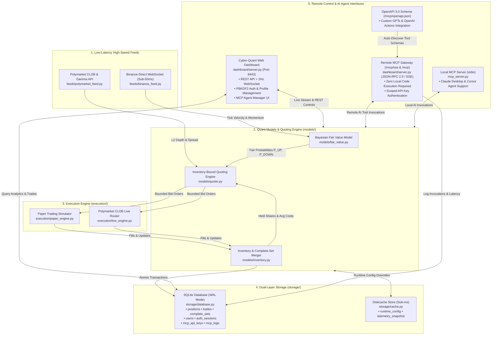

# Poly-Harvester Quantitative Engine 🚀

A high-performance, institutional-grade quantitative trading and arbitrage engine designed for Polymarket binary prediction contracts (e.g., BTC 15m/5m/1h Up/Down contracts). It implements **Complete-Set Risk-Free Arbitrage**, **Avellaneda-Stoikov Inventory Skewing**, **Sub-50ms Binance Direct WebSocket Momentum Tracking**, **SQLite WAL + Diskcache Dual-Layer Persistence**, a **Cyber-Quant Web Dashboard with PBKDF2 Authentication**, a **Remote Model Context Protocol (MCP) Server (SSE + JSON-RPC + OpenAPI)**, and an **Integrated MCP Manager with API Key Security and Real-Time Request/Response Monitoring**.

---

## 🏛️ System Architecture



---

## 🌐 Remote MCP: Zero Local Code Execution

You **do not need to run Python locally on your client machine** to let Claude, Cursor, Antigravity, or any AI access the server. Simply provide the server's **Remote URL** and your **MCP API Key**:

```
┌────────────────────────────────────────────────────────┐
│  AI Client (Claude / Cursor / Antigravity / Agent)     │
│  • Remote URL: http://<SERVER_IP>:8443/mcp/sse        │
│  • API Key:   mcp_live_YOUR_KEY                        │
└───────────────────────────┬────────────────────────────┘
                            │ (Remote MCP / SSE or HTTP)
                            ▼
┌────────────────────────────────────────────────────────┐
│  Poly-Harvester Server (VPS / Cloud / Local)           │
│  • Validates API Key in SQLite                         │
│  • Runs Quoting Engine & Binance Feeds                 │
│  • Executes Tool Calls & Returns JSON Results          │
│  • Logs Execution Latency into SQLite mcp_logs         │
└────────────────────────────────────────────────────────┘
```

---

## 🛠️ Remote MCP Client Setup Guides

### 1. Claude Desktop (`claude_desktop_config.json`)
Connects to your remote server over SSE without running local Python:
```json
{
  "mcpServers": {
    "poly-harvester": {
      "url": "http://localhost:8443/mcp/sse",
      "headers": {
        "X-MCP-API-Key": "mcp_live_YOUR_KEY_HERE"
      }
    }
  }
}
```

### 2. Cursor IDE (`.cursor/mcp.json`)
```json
{
  "mcpServers": {
    "poly-harvester": {
      "url": "http://localhost:8443/mcp/sse",
      "headers": {
        "X-MCP-API-Key": "mcp_live_YOUR_KEY_HERE"
      }
    }
  }
}
```

### 3. Direct JSON-RPC 2.0 HTTP Endpoint (`POST /mcp`)
Works with any HTTP client or AI agent framework (LangChain, AutoGen, CrewAI):
```json
{
  "mcpServers": {
    "poly-harvester-rpc": {
      "url": "http://localhost:8443/mcp",
      "headers": {
        "X-MCP-API-Key": "mcp_live_YOUR_KEY_HERE"
      }
    }
  }
}
```

### 4. Custom GPTs / OpenAI Actions
* **OpenAPI 3.0 Schema URL**: `http://localhost:8443/mcp/openapi.json`
* **Authentication**: API Key (`Header`: `X-MCP-API-Key`)
* Imports all 8 tools automatically into ChatGPT with complete parameter schemas.

### 5. Direct cURL Execution
```bash
curl -X POST http://localhost:8443/api/mcp/execute/poly_get_status \
  -H "Content-Type: application/json" \
  -H "X-MCP-API-Key: mcp_live_YOUR_KEY_HERE" \
  -d '{}'
```

---

## 🧰 Available MCP Tools

| Tool Name | Scope | Description |
| :--- | :---: | :--- |
| `poly_get_status` | Read | Returns real-time Binance spot price, tick velocity, active quotes, sets merged, and PnL. |
| `poly_get_inventory` | Read | Returns UP/DOWN position breakdown, average costs, inventory skew, and net delta. |
| `poly_get_trades_history` | Read | Queries SQLite `trades` table with `limit` and `offset` pagination. |
| `poly_get_complete_sets` | Read | Queries historical complete-set merge events and locked arbitrage profits. |
| `poly_get_analytics` | Read | Returns cumulative volume, win rate, fees paid, average pair cost, and margin %. |
| `poly_emergency_stop` | Write | Immediately halts quoting, cancels all limit bids, and triggers circuit breaker. |
| `poly_resume_trading` | Write | Resets circuit breaker and resumes automated market making. |
| `poly_update_risk_limits` | Write | Dynamically updates order size, inventory cap, stop-loss, and cost ceiling. |

---

## 🔐 Dashboard & API Key Management

* **Dashboard URL**: [http://localhost:8443](http://localhost:8443)
* **Default Admin**: `admin` / `polyharvester2026`
* **Generate MCP Keys**: Open the **`MCP Agent Manager`** tab in the dashboard and click **`+ Generate MCP Key`**.
* **Audit & Monitor**: Inspect real-time tool calls, latency in milliseconds, and full JSON payloads in the **Live Request & Response Logs** table.

---

---

## ⚡ Official Polymarket SDK (`py-sdk`) & Live Trading Engine

Poly-Harvester utilizes the official **[Polymarket Python SDK (`polymarket-client`)](https://github.com/Polymarket/py-sdk)** (`from polymarket import AsyncSecureClient, AsyncPublicClient`) with institutional-grade execution features:

### 1. Token-Bucket Trading Rate Limiting
Per the official [Polymarket Trading Rate Limits](https://docs.polymarket.com/api-reference/trading-rate-limits) specification:
* **Order Bucket**: 40 tokens/s continuous refill, 60 tokens burst capacity (`POST /order`, `POST /orders`).
* **Cancel Bucket**: 80 tokens/s continuous refill, 120 tokens burst capacity (`DELETE /order`, `DELETE /cancel-all`).
* **Automatic Backoff**: Automatically parses `Poly-RateLimit-Remaining`, `Poly-RateLimit-Reset`, `Poly-RateLimit-Tier`, and applies exponential backoff on `Retry-After` (HTTP 429).

### 2. Geographic Restrictions & Proxy Support
Per the official [Polymarket Geographic Restrictions](https://docs.polymarket.com/api-reference/geoblock) specification:
* Automated IP verification via `GET https://polymarket.com/api/geoblock`.
* Outbound HTTPS/SOCKS5 proxy support allows seamless trading routing from restricted locations (e.g., US) through compliant server regions (e.g., `eu-west-1` or `eu-west-2`).
* Real-time compliance indicator displayed on dashboard header (`GEO: ELIGIBLE` or `GEO: RESTRICTED`).

### 3. Strict $300 Capital Bankroll Rules & Risk Safeguards
* **Total Bankroll Ceiling**: $300.00 USD max capital.
* **Order Size Limit**: 20 shares (~$9.00 - $10.00 max per order leg).
* **Inventory Imbalance Cap**: Max 60 unhedged shares (~$28.00 maximum net delta exposure).
* **Daily Stop Loss Circuit Breaker**: -$25.00 daily loss trigger cancels all open limit bids instantly.
* **Complete-Set Arbitrage Merge**: Calls `merge_multiple_positions` to automatically redeem UP + DOWN pairs into $1.00 USDC locked profit.

### 4. Isolated Trading Sessions & Dynamic Capital Allocation
* **Zero Auto-Trading on Boot**: Poly-Harvester boots in **STANDBY** state. High-speed Binance and Polymarket feeds stream market data, implied probabilities, and book metrics 24/7 without placing orders until a session is explicitly started.
* **Configurable Trading Amount**: When launching a session, operators configure **Allocated Bankroll Capital** ($20 to $300 max) and **Order Size** (shares per leg).
* **Complete Session Data Isolation**: The dashboard, order history, complete-sets ledger, and performance analytics display only the active session's data by default.
* **Historical Session Switcher**: Operators can dynamically switch views between **Active Session (Live)**, **Historical Past Sessions** (loading exact snapshot metrics), and **All-Time Aggregate History**.
* **Interactive Session Lifecycle**: Start, Pause, Resume, and Stop & Archive sessions with single-click UI controls or REST/MCP APIs.

### 5. Live CLOB vs 99% Accurate Paper Simulation
* **Paper Trading Mode (Default)**: Emulates real CLOB order fills against live market asks and printed CLOB trade ticks with $\ge 50\text{ms}$ in-flight network latency guards and strict bankroll limits.
* **Live CLOB Execution Mode**: Connects directly to Polymarket CLOB with Polygon EIP-712 order signing. Configurable dynamically in the **Polymarket Live SDK** modal with safety confirmation dialogs.

---

## 🚀 Quick Start

### 1. Start Server
```bash
python main.py
```

### 2. Access Dashboard & Start Trading
1. Open [http://localhost:8443](http://localhost:8443).
2. Login with default credentials (`admin` / `polyharvester2026`).
3. Click **`Start Trading`** in the top navigation bar to launch an isolated session with your preferred capital bankroll ($20–$300) and execution mode!
4. Use the **Session Switcher** dropdown to review past runs, inspect fills, and track complete-set arbitrage profits.

